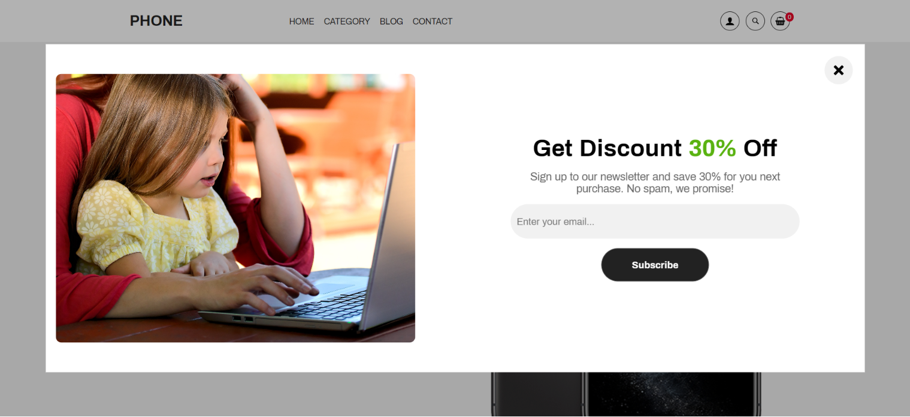
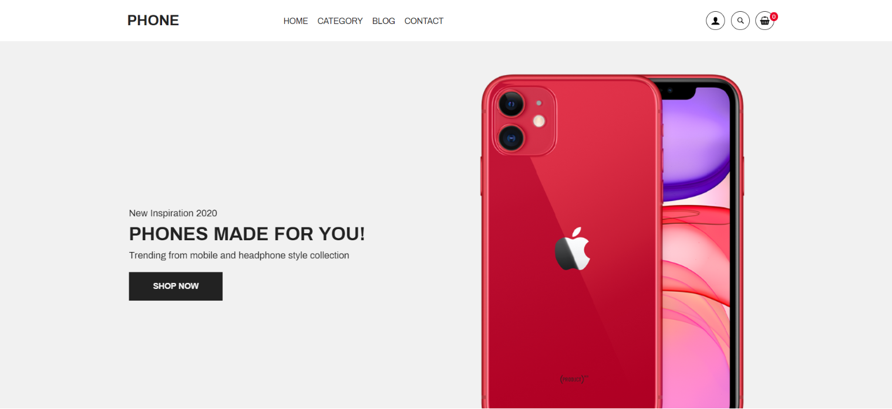
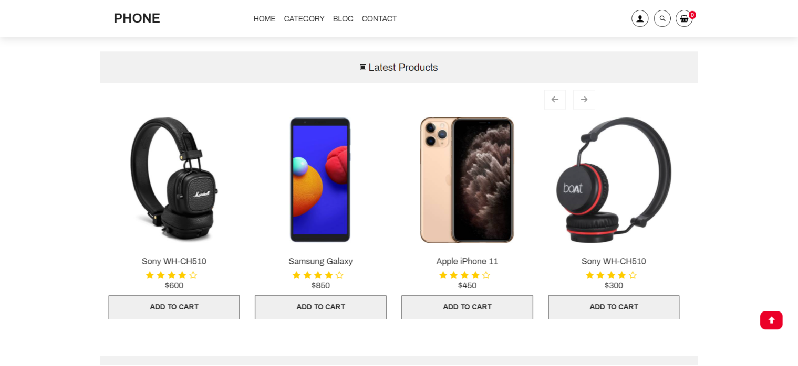
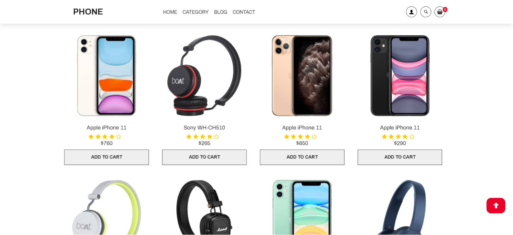

# Responsive Ecommerce Website Using HTML CSS JAVASCRIPT

Responsive Ecommerce Website Using HTML CSS JAVASCRIPT

This is not E-Commerce-web-shop , I have it but in a separate project. Here you can find Source code for E-Commerce-web-shop on GitHub: " https://github.com/islamhassan1/E-Commerce-web-shop ".

## Screenshots

